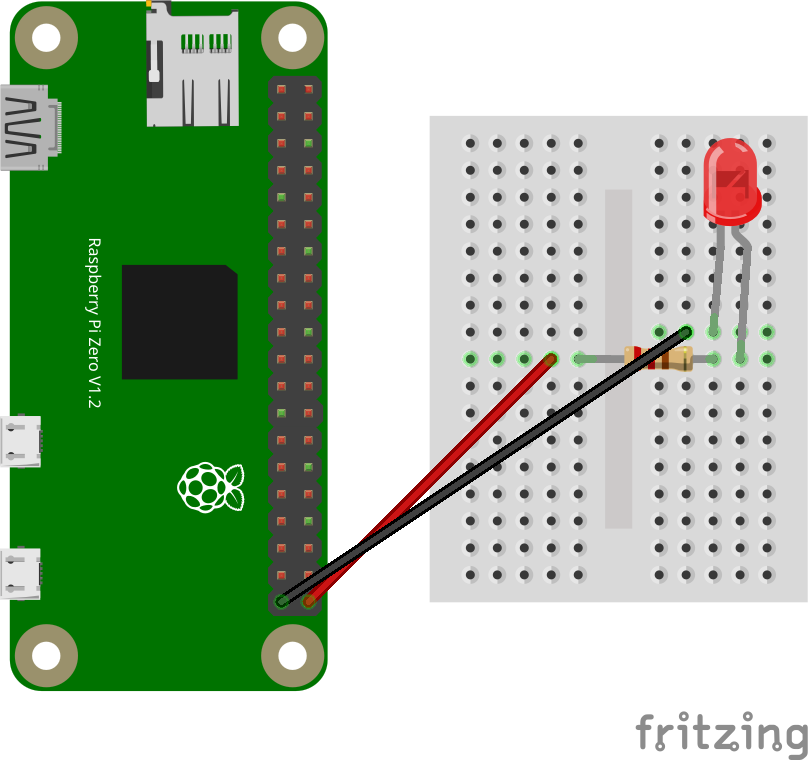

# 🎄 Christmas Lights Controller

A Raspberry Pi project to control Christmas lights via a web interface with multiple lighting modes.



## 📋 Description

This project allows you to control Christmas lights through a Raspberry Pi using a simple web interface. The application offers different lighting modes that can be selected from any device connected to the same network as the Raspberry Pi.

### Main Features

- **Web Control**: Responsive web interface accessible from smartphones, tablets, or computers
- **Multiple Modes**: Various lighting modes to create festive atmospheres
- **PWM Control**: Precise brightness control through PWM modulation
- **Multi-threading**: Parallel management of web server and LED control
- **Remote Shutdown**: Ability to shut down the system from the web interface

## 🎨 Available Modes

### 🔆 Fixed
Lights remain on at constant maximum intensity.

### 🌊 Fade
Gradual fade effect: lights slowly increase in intensity to maximum, then decrease until they turn off, creating a continuous "breathing" cycle.

### ✨ Show
A complex sequence that combines different effects:
- Initial flash
- Rapid sequence of on/off switching
- Gradual fade in and fade out

### 📡 Morse
Lights transmit the message "MERRY CHRISTMAS" in Morse code, using:
- Dots (short signals) of 0.2 seconds
- Dashes (long signals) of 0.6 seconds
- Pauses between letters and words according to Morse standard

### 🎵 Music Player (NEW!)
Upload an MP3 file and the system will:
1. Convert the audio to MIDI using BasicPitch AI (optimized for melody extraction)
2. Extract musical notes and frequencies from the MIDI file
3. Play the melody through a passive buzzer connected to GPIO18

**Note**: The conversion focuses on melody extraction, filtering out vocals and isolating the main musical line.

## 🔧 Required Hardware

- Raspberry Pi (any model with GPIO)
- Christmas lights or LED strip
- **Passive buzzer** (for music playback)
- Appropriate resistors
- Power supply for the lights (if needed)
- Connecting wires
- Transistor or LED driver (e.g., MOSFET) - only if required by your specific lights

### Pin Configuration

- **GPIO21**: LED/Christmas lights control (PWM)
- **GPIO18**: Passive buzzer for music playback

### Circuit Scheme

The complete circuit is available in the `docs/` folder both in Fritzing format (`.fzz`) and as a PNG image. 

**Important Notes:**
- The circuit uses **GPIO 21** because it supports hardware PWM. Changing to a different pin may result in poor performance or loss of PWM functionality.
- The **resistor value** shown in the schematic is arbitrary and must be calculated based on the actual lights you connect.
- The **red LED** in the diagram is just a placeholder. In the actual implementation, this should be replaced with your real Christmas lights (connected through an appropriate driver/transistor).

## 💻 Technologies Used

- **Python**: Main project language
- **Flask**: Web framework for the user interface
- **gpiozero**: Library for Raspberry Pi GPIO control
- **Bootstrap 5**: CSS framework for responsive interface
- **Threading**: For parallel management of web server and LED control
- **BasicPitch**: AI model for audio to MIDI conversion
- **Mido**: MIDI file processing library
- **TensorFlow**: Deep learning framework (required by BasicPitch)

## 🚀 Installation

### Prerequisites

```bash
# Update the system
sudo apt update && sudo apt upgrade -y

# Install Python and pip if not already present
sudo apt install python3 python3-pip -y

# Install system dependencies for audio processing
sudo apt install libsndfile1 ffmpeg -y
```

### Install Dependencies

```bash
# Clone the repository
git clone https://github.com/manusanchi02/christmas-lights.git
cd christmas-lights

# Install all required Python libraries from requirements.txt
pip3 install -r requirements.txt
```

**Note**: The installation of TensorFlow and BasicPitch may take some time on a Raspberry Pi.

### Setup

1. Make sure your lights are correctly connected to **GPIO 21** through an appropriate driver circuit
2. Connect the passive buzzer to **GPIO 18** (positive terminal to GPIO18, negative to GND)

## 📱 Usage

### Starting the Application

```bash
python3 app.py
```

The application will be accessible from:
- Local: `http://localhost:5000`
- From other devices: `http://[RASPBERRY-PI-IP]:5000`

### Web Interface

The interface features:
- Current light status indicator
- Mode selection buttons (Fade, Fixed, Show, Morse)
- **MP3 upload form** for music playback on the buzzer
- Shutdown button to power off the system

### Using the Music Player

1. Access the web interface at `http://[RASPBERRY-PI-IP]:5000`
2. Scroll to the "Riproduci Melodia" section
3. Click "Choose File" and select an MP3 file from your device
4. Click "Converti e Riproduci sul Buzzer"
5. The system will:
   - Convert the MP3 to MIDI using AI (BasicPitch)
   - Extract the melody notes
   - Play the frequencies through the passive buzzer on GPIO18

**Tips for best results**:
- Use MP3 files with clear melodies
- Instrumental tracks work better than vocal-heavy songs
- The conversion focuses on extracting the main melody line
- Processing time depends on file length and Raspberry Pi model

### iOS Shortcut for Quick Launch

For iOS users, you can create a Siri shortcut to start the application remotely via SSH:

1. Open the **Shortcuts** app on your iOS device
2. Tap **+** to create a new shortcut
3. Add the **"Run Script Over SSH"** action
4. Configure the SSH connection:
   - **Host**: Your Raspberry Pi's IP address
   - **Port**: 22 (default SSH port)
   - **User**: Your Raspberry Pi username (usually `pi`)
   - **Authentication**: Use password or SSH key
5. In the **Script** field, enter the command to start the application:
   ```bash
   cd ~/christmas-lights && python3 app.py
   ```
   Or use the full path if located elsewhere:
   ```bash
   cd /path/to/christmas-lights && python3 app.py
   ```
6. Name your shortcut (e.g., "Start Christmas Lights")
7. Optionally, add it to your home screen or use with Siri voice commands

**Tip**: You can create separate shortcuts for different modes by using curl commands to directly trigger specific endpoints:
```bash
curl -X POST http://[RASPBERRY-PI-IP]:5000/toggle_fade
```

## 🛠️ Advanced Configuration

### Changing GPIO Pins

In the `app.py` file, modify the variables:
```python
ledPin = 21     # Change to desired pin for lights
buzzerPin = 18  # Change to desired pin for buzzer
```

**⚠️ Warning**: GPIO 21 is used because it supports hardware PWM. Changing to a non-PWM pin may result in flickering or poor performance. Raspberry Pi hardware PWM pins are: GPIO 12, 13, 18, and 19. See [GPIO scheme](https://pinout.xyz/#)

### Tuning Music Playback

You can adjust the music conversion parameters in the `mp3_to_midi_and_play()` function:

```python
onset_threshold=0.5,      # Lower = more sensitive to note onsets (0.0-1.0)
frame_threshold=0.3,      # Lower = keeps weaker notes (0.0-1.0)
minimum_note_length=100,  # Minimum note duration in milliseconds
melodia_trick=True,       # Keep True for melody extraction
```

### Customizing Effects

All lighting effects are defined in the `control_led()` function in `app.py`. You can modify:
- Transition speeds (`sleep()` parameters)
- Maximum/minimum intensity (`pwm_led.value`)
- On/off sequences

### Custom Morse Message

Modify the string in `app.py`:
```python
morse_code = "MERRY CHRISTMAS"  # Customize your message
```

## 📁 Project Structure

```
christmas-lights/
├── app.py                 # Main Flask application
├── requirements.txt       # Python dependencies
├── templates/
│   └── index.html        # Web interface
├── static/
│   └── style.css         # CSS styles
├── docs/
│   ├── scheme.fzz        # Fritzing scheme
│   └── scheme.png        # Circuit scheme image
├── LICENSE
└── README.md
```

## ⚙️ How It Works: MP3 to Buzzer

1. **Upload**: User uploads an MP3 file through the web interface
2. **AI Conversion**: BasicPitch (Spotify's AI model) analyzes the audio and converts it to MIDI
   - Uses deep learning to detect pitch and timing
   - `melodia_trick=True` optimizes for melody extraction, filtering out vocals
3. **MIDI Processing**: Mido reads the MIDI file and extracts note events
4. **Frequency Calculation**: Each MIDI note number is converted to its frequency in Hz
   - Formula: `f = 440 × 2^((n-69)/12)` where n is the MIDI note number
5. **Buzzer Playback**: GPIO18 is toggled at the calculated frequency to produce the tone
   - The passive buzzer vibrates at the specified frequency, creating sound

## 🔒 Security

- The application is configured to accept connections from any IP address on the local network (`host='0.0.0.0'`)
- Debug mode is disabled for security reasons
- It is recommended to use the application only on trusted networks

## 📝 License

This project is released under the license specified in the LICENSE file.

## 🤝 Contributing

Contributions, issues, and feature requests are welcome!

## 👤 Author

**manusanchi02**

- GitHub: [@manusanchi02](https://github.com/manusanchi02)

## 🎅 Happy Holidays!

Enjoy your Raspberry Pi-controlled Christmas lights! 🎄✨
